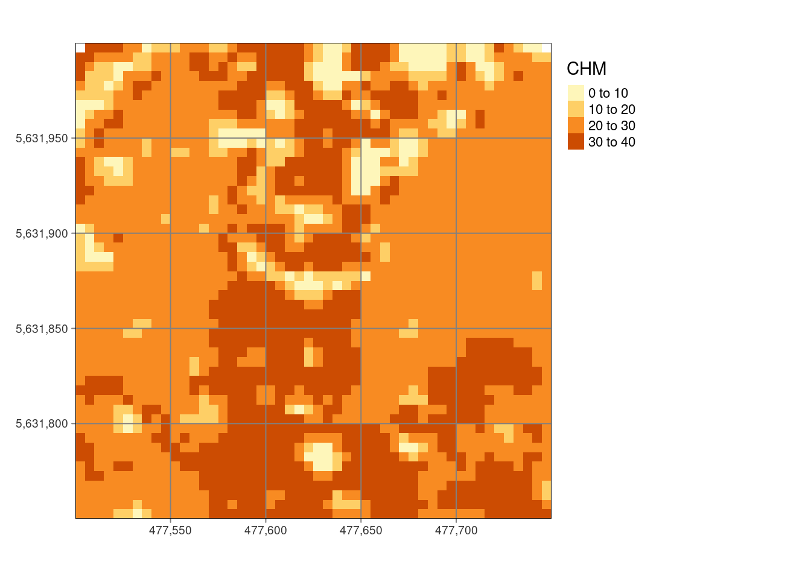
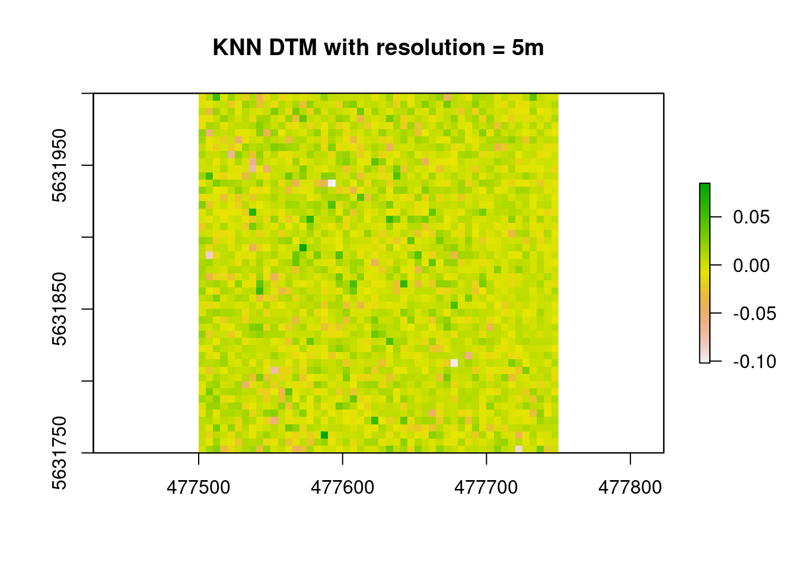
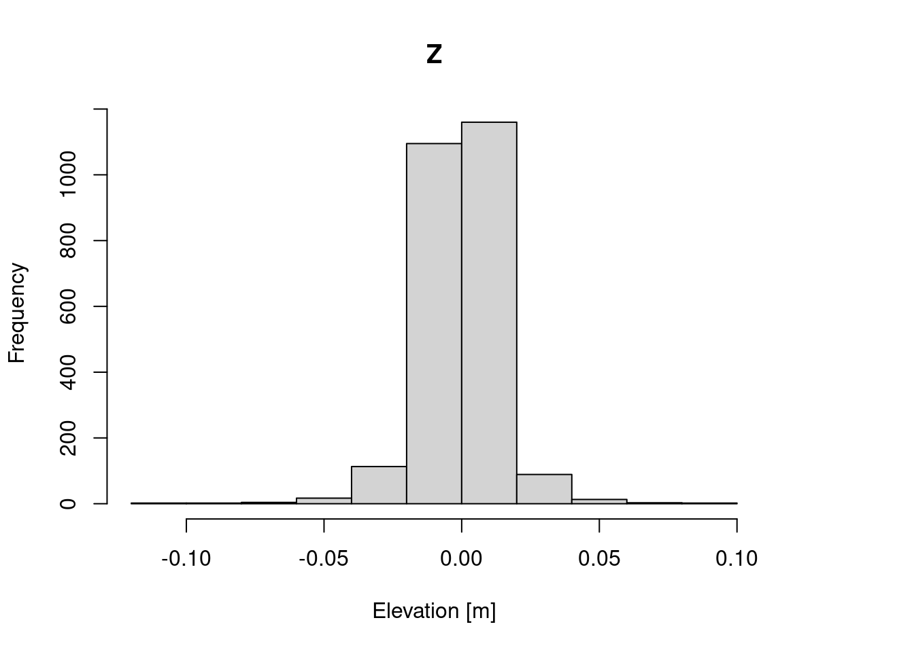
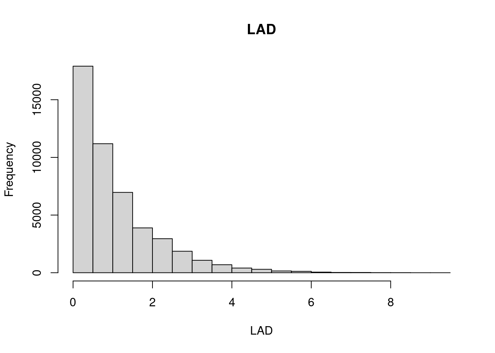
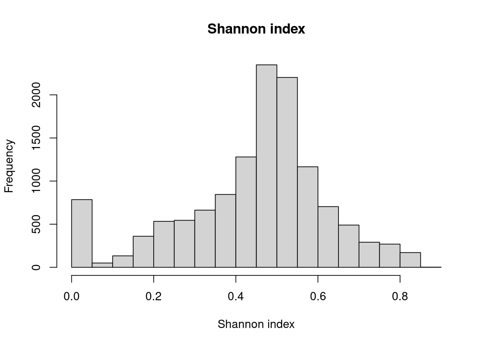
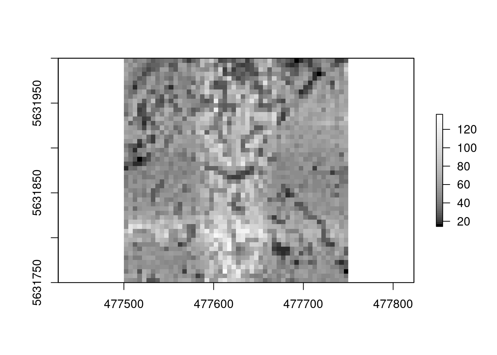
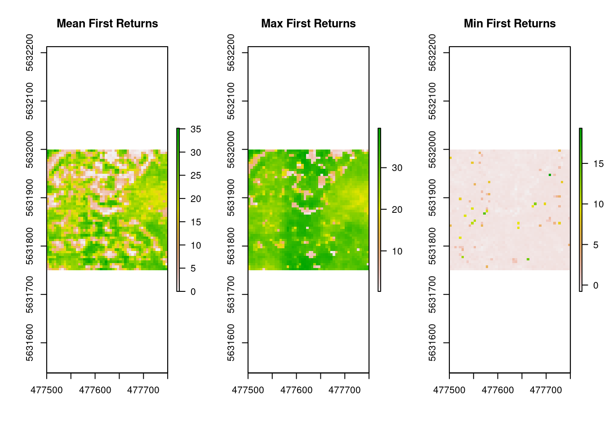
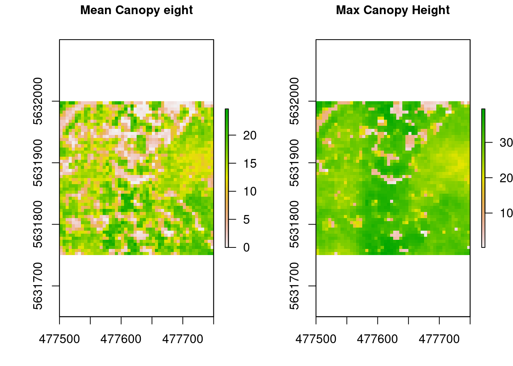
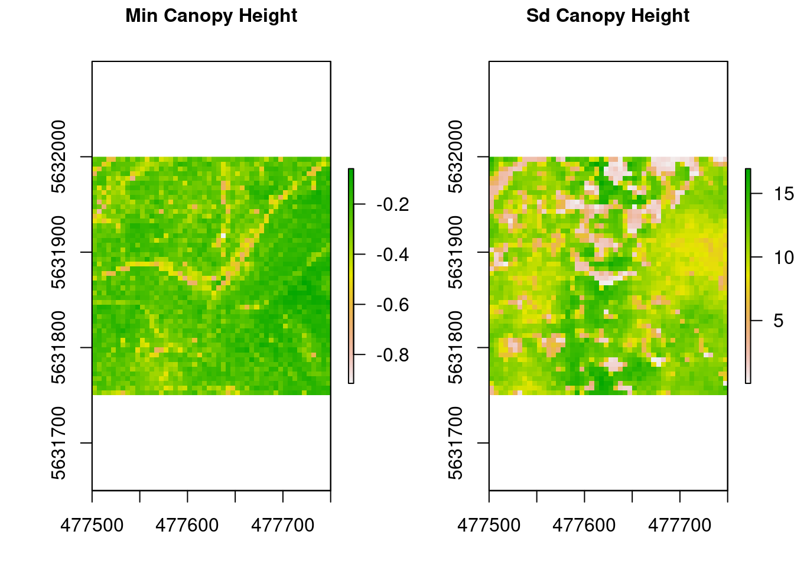

## Introduction

In this blog post different lidR metrics and ecological indices are calculated using Lidar data. These will be used to model forest microclimate in future applications.

## Data and Methods

Only one tile from the calculated lidR catalog is used, due to computation time. The lidR catalog 
was calculated using the provided script from <https://gisma-courses.github.io/gi-modules/post/2021-11-20-forest-information-from-lidar-data/>.
Using the lidR Package, different metrics and ecological indices are calculated at grid- and voxel level. Afterwards they are stacked for convenient accessibility for future modelling of forest microclimate.

**The calculated metrics and indices are:**

- Standard deviation (SD) & Maximum, Minimum of the First Returns:
- Leaf Area Density (LAD) and Shannon Index of the LAD
- Canopy Height Model & Normalized Parameters
- Digital Terrain Model
- Point Density Metrics

**Why were these metrics/indices chosen:**

These metrics are a prototype draft and were chosen based on discussions in the Agis course and past studies. 
It was found that metrics of the first returns, the LAD and the Shannon Index seem to be correlated to temperature and can be used to predict microclimate (Carrasco et al. 2019). According to Latif et al. (2012)  elevation-based metrics might be beneficial to model microclimate in forests. DTMs could also be useful to include in a model as variables like exposition could impact the microclimate depending on the location. As it was discussed in the course, point density might also be a strong predictor for forest microclimate.


## Calculation & Results

First, visualize the LAS


```r
#plot(ras, main = "Rasterized LAS")
```

Calculate SD of the first returns with a resolution of 5m and visualize 


```r
sd_FR <- grid_metrics(las, func = sd(Z), res = 5, by_echo = "first")
plot(sd_FR, main = "SD First returns [m]")
```


Normalize height and build CHM with standard pitfree parameters (use ?pitfree for reference)




Calculate Digital Terrain Model (DTM) with k-nearest neighbor approach (Reference: ?knnidw)


```r
DTM <- lidR::grid_terrain(las, res = 5.0, algorithm = lidR::knnidw(k = 10, p = 2))
```

```
## Warning: There were 5 degenerated ground points. Some X Y coordinates were
## repeated but with different Z coordinates. min Z were retained.
```

```r
lidR::plot(DTM, main = "KNN DTM with resolution = 5m")
```



```r
hist(DTM, xlab = "Elevation [m]")
```



Calculate LAD & LAD based Shannon Index


```r
LAD <- voxel_metrics(las, func = LAD(Z), res = 5)
LAD <- na.omit(LAD)

LAD_Shannon <- voxel_metrics(las, func = entropy(Z), res = 5)
LAD_Shannon <-na.omit(LAD_Shannon)
```


Calculate Point density


```r
pdense <- lidR::grid_metrics(nLas, ~length(Z)/25, res = 5.0)
```


Calculate some more standard metrics for the first returns and canopy height


```r
mean_FR <- grid_metrics(las, func = ~mean(Z), res = 5, by_echo = "first")
max_FR <- grid_metrics(las, func = ~max(Z), res = 5, by_echo = "first")
min_FR <- grid_metrics(las, func = ~min(Z), res = 5, by_echo = "first")

h_mean <- lidR::grid_metrics(nLas, func = ~mean(Z), res = 5.0)
h_max <- lidR::grid_metrics(nLas, func = ~max(Z), res = 5.0)
h_min <- lidR::grid_metrics(nLas, func = ~min(Z), res = 5.0)
h_sd <- lidR::grid_metrics(nLas, func = ~sd(Z), res = 5.0)
```



Stack all of the calculated metrics and indices together


```r
lidarstack <- stack(CHM, DTM, h_max, h_mean, h_min, h_sd, max_FR, mean_FR, min_FR, sd_FR, pdense)
names(lidarstack)
```

```
##  [1] "CHM"           "DTM"           "h_max"         "h_mean"       
##  [5] "h_min"         "h_sd"          "max_FR"        "mean_FR"      
##  [9] "min_FR"        "sd_FR"         "point_density"
```

```r
#saveRDS(lidarstack, paste0(envrmt$path_data, "lidarstack.RDS"))
plot(lidarstack)
```


## References

Carrasco, L., Giam, X., Papeş, M. & Sheldon, K.S. (2019): Metrics of Lidar-Derived 3D Vegetation Structure Reveal Contrasting Effects of Horizontal and Vertical Forest Heterogeneity on Bird Species Richness. Remote Sens. 11, 743.

Latif, Z.A. (2012): Forest Microclimate Modelling Using Remotely Sensed Data. ISrJ 2 (1), 19-25.

Roussel, J.-R., Goodbody, T.R.H. & Tompalski, P. (2021): The lidR package. https://jean-romain.github.io/lidRbook/index.html (access: 28.12.2021).
put all references here


